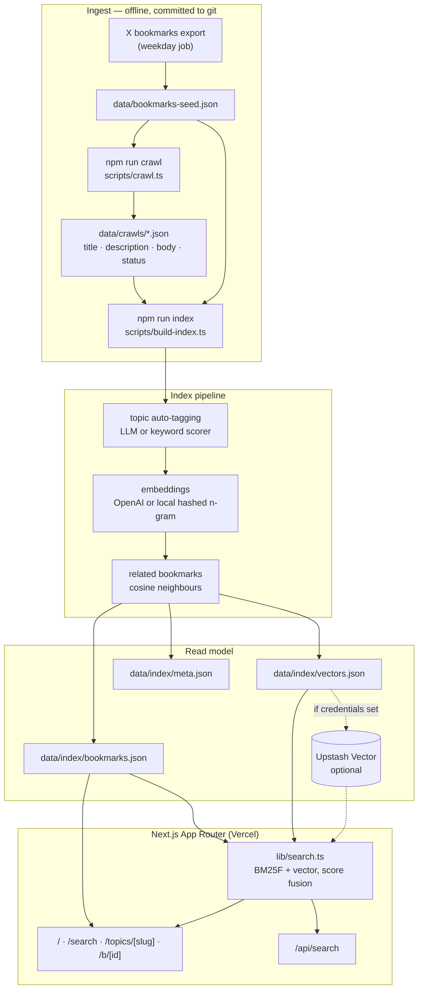

# bookmarks

Searchable personal library of Sean Geng's X bookmarks — crawled, topic-grouped, vector-indexed.
Live at **[bookmarks.seangeng.com](https://bookmarks.seangeng.com)**.

A saved post is only half the artifact; the page it links to is the other half. This project
crawls the linked pages, archives what it finds, auto-tags everything into a small topic
taxonomy, embeds it, and puts hybrid semantic + keyword search on top.

```bash
npm install
npm run sync    # crawl external links, then build the search index
npm run dev     # http://localhost:3000
```

No credentials are required. With an empty environment the pipeline uses local hashed
embeddings and a committed vector file, so search works end to end out of the box; adding
`OPENAI_API_KEY` upgrades it to real semantic embeddings and LLM topic classification, and
adding Upstash credentials moves the vectors off-box.

---

## Architecture



Everything left of the app is offline and committed to git, so a page render needs no
database, no network, and no cold-start warmup. The only runtime dependency is the embedding
call for the search query itself — and with the local provider even that is in-process.

---

## Data model

A bookmark, as stored in `data/bookmarks-seed.json` ([`src/lib/types.ts`](src/lib/types.ts)):

| Field | Type | Notes |
| --- | --- | --- |
| `id` | `string` | X post id, and the site's URL key (`/b/<id>`) |
| `text` | `string` | Post text |
| `author` | `{ name, handle, avatar_url? }` | |
| `url` | `string` | Canonical post URL |
| `created_at` | `string` | ISO 8601 |
| `bookmarked_at` | `string?` | When the export provides it |
| `external_urls` | `string[]` | Outbound links, normalized and de-`t.co`'d |
| `topics` | `string[]` | Hints from the export; treated as authoritative during indexing |
| `media`, `metrics` | optional | Carried through if present |

The seed loader ([`src/lib/normalize.ts`](src/lib/normalize.ts)) is deliberately forgiving: it
accepts a bare array, `{ bookmarks: [...] }`, or `{ data: [...] }`, in snake_case or the shapes
the X API v2 returns (`legacy.full_text`, `entities.urls[].expanded_url`, `core.screen_name`,
Twitter's `"Wed Oct 10 20:19:24 +0000 2018"` dates, …). It de-duplicates by id and sorts newest
first. Anything it cannot parse is counted and reported rather than silently dropped.

Indexing produces two derived artifacts per bookmark: an enriched record (topics, per-link
crawl summary, a search blob, precomputed related ids) and an embedding vector.

---

## Scripts

| Command | What it does |
| --- | --- |
| `npm run dev` | Next dev server |
| `npm run build` | Production build (`prebuild` regenerates the index if artifacts are missing) |
| `npm run start` | Serve the production build |
| `npm run crawl` | Fetch every unique external URL, write artifacts to `data/crawls/` |
| `npm run index` | Enrich + auto-tag + embed, write `data/index/`, optionally upsert to Upstash |
| `npm run sync` | `crawl` then `index` |
| `npm run lint` / `npm run typecheck` | ESLint / `tsc --noEmit` |

Useful flags:

```bash
npm run crawl -- --force              # re-crawl everything
npm run crawl -- --max-age=7          # re-crawl artifacts older than 7 days
npm run crawl -- --retry-failed       # retry timeouts / 5xx / empty extractions
npm run crawl -- --limit=20 --concurrency=3 --timeout=15000
npm run crawl -- --ignore-robots      # local debugging only

npm run index -- --provider=local     # force local embeddings even with a key set
npm run index -- --store=local        # skip the Upstash upsert
npm run index -- --no-llm             # force the keyword topic classifier
npm run index -- --dry-run            # print the index summary, write nothing
```

### Crawling

`scripts/crawl.ts` is intentionally polite:

- concurrency capped at **5** (`CRAWL_CONCURRENCY`), hard-capped in code
- **10s** timeout per request (`CRAWL_TIMEOUT_MS`), response body capped at 2.5 MB
- `robots.txt` is fetched once per origin, parsed with wildcard/`$` pattern support and
  longest-match precedence, and `Crawl-delay` is honoured (capped at 5s)
- a 750 ms minimum gap between requests to the same host
- a descriptive User-Agent that points back at the site
- results are cached, so re-runs only fetch links that are new or stale

Every attempt is recorded with a status — `ok`, `empty`, `unsupported_type`, `http_error`,
`network_error`, `timeout`, `blocked_by_robots` — so dead links stay visible in the UI instead
of disappearing. Text extraction strips page chrome, picks the densest plausible content
container, and keeps up to 5k characters of block-level text.

The committed sample crawl covers 49 links: 43 archived, 2 PDFs skipped as non-HTML, 1 host
returning 403, 1 dead domain, 1 page with no extractable text. That mix is deliberate — it
exercises the failure paths.

---

## Search

[`src/lib/search.ts`](src/lib/search.ts) runs two legs and fuses them.

**Keyword leg** — BM25 with BM25F-style field weights, so a term in the post itself (×3.2) or a
linked page's title (×2.4) counts for more than the same term buried in crawl body text (×1).
Exact phrases get a bonus, larger when the phrase appears in the post or a title. The tokenizer
keeps compounds whole *and* split (`zero-knowledge` → `zero-knowledge`, `zero`, `knowledge`),
and every long token is additionally indexed under a truncated prefix at reduced weight, so
`accessibility` finds `accessible`.

**Vector leg** — the query is embedded with the same provider that built the index (recorded in
`data/index/meta.json`; a mismatch is detected and reported rather than silently returning
garbage), then compared against the vector store.

**Fusion** — normalized score fusion, not reciprocal rank fusion. RRF is deliberately
insensitive to score magnitude, which is the wrong default here: a query like `error budgets`
has one obviously correct answer and a long tail of pages that merely contain the word
"error". Instead, keyword scores are normalized against the best hit for that query, and cosine
similarity is mapped through a provider-calibrated confidence window. That window is what keeps
the local provider honest — its hashed n-gram vectors are lexical, not semantic, so a 0.06
cosine contributes a nudge; real embeddings clear the window and become a first-class ranking
signal. Vector-only hits must clear a confidence floor to appear at all.

If the embedding provider is unavailable at request time, the vector leg is skipped, the mode
badge switches to "keyword only", and the UI says so.

`/api/search?q=…&topic=…&limit=…` returns the same results as JSON, including `keyword_rank`
and `vector_rank` per hit so ranking decisions stay debuggable.

### Topics

Seven fixed buckets: **AI/ML, UI/Design, DevTools, Infra, Crypto, Reading, Misc**
([`src/lib/topics.ts`](src/lib/topics.ts)). A bookmark can hold up to three.

Assignment during indexing, in priority order:

1. topics supplied by the export, if any
2. LLM classification (`OPENAI_CHAT_MODEL`, default `gpt-4o-mini`) when `OPENAI_API_KEY` is set
3. otherwise a weighted keyword + link-domain scorer, with diminishing returns per repeated
   term so one word cannot dominate

The scorer is the fallback but not a toy: on the sample seed it produces the same buckets a
human would, and the classifier actually used is recorded in `data/index/meta.json` and shown
in the site footer. Failures in step 2 fall back to step 3 rather than aborting the run.

---

## Vector backend

The store is chosen from the environment, and the app degrades rather than breaks.

| Backend | When it is used | Notes |
| --- | --- | --- |
| **Local JSON** (default) | no Upstash credentials | `data/index/vectors.json`, exact cosine in-process. Single-digit ms for thousands of bookmarks — a legitimate default, not a stub. |
| **Upstash Vector** | `UPSTASH_VECTOR_REST_URL` + `UPSTASH_VECTOR_REST_TOKEN` | Serverless, free tier, no ops. `npm run index` resets and upserts the index with `topics` metadata; topic-filtered search pushes the filter down to Upstash. |

Force either with `VECTOR_STORE=local|upstash`.

To move to Upstash: create an index at [console.upstash.com](https://console.upstash.com/vector)
with the dimension of your embedding model (**1536** for `text-embedding-3-small`, **512** for
the local provider) and cosine distance, put the REST URL and token in the environment, and
re-run `npm run index`. The vectors file stays in git as a fallback.

Two alternatives were considered and skipped: **Neon + pgvector** needs a connection pooler and
migrations for a dataset that fits in a JSON file, and **Turso/libSQL** would add a second
storage system without removing the embedding call. `VectorStore` in
[`src/lib/vector-store.ts`](src/lib/vector-store.ts) is a two-method interface, so adding either
later is a self-contained change.

---

## Environment variables

Everything is optional. Copy [`.env.example`](.env.example) to `.env.local` and fill in what you
have.

| Variable | Default | Purpose |
| --- | --- | --- |
| `NEXT_PUBLIC_SITE_URL` | `https://bookmarks.seangeng.com` | Canonical origin for metadata, `sitemap.xml`, `robots.txt` |
| `OPENAI_API_KEY` | — | Enables semantic embeddings and LLM topic classification |
| `OPENAI_EMBEDDING_MODEL` | `text-embedding-3-small` | |
| `OPENAI_CHAT_MODEL` | `gpt-4o-mini` | Topic classification |
| `OPENAI_BASE_URL` | `https://api.openai.com/v1` | Any OpenAI-compatible endpoint works |
| `EMBEDDING_PROVIDER` | auto | `openai` \| `local` |
| `UPSTASH_VECTOR_REST_URL` | — | Upstash Vector REST endpoint |
| `UPSTASH_VECTOR_REST_TOKEN` | — | Upstash Vector token |
| `UPSTASH_VECTOR_NAMESPACE` | — | Optional namespace |
| `VECTOR_STORE` | auto | `upstash` \| `local` |
| `CRAWL_CONCURRENCY` | `5` | Hard-capped at 5 |
| `CRAWL_TIMEOUT_MS` | `10000` | Per-request timeout |

Secrets are never committed: `.env*` is git-ignored and the index/crawl artifacts contain only
public page content.

---

## Sync: replacing the seed with a fresh export

The weekday export job produces a JSON file of bookmarks. To refresh the library:

```bash
cp ~/exports/x-bookmarks-2026-09-08.json data/bookmarks-seed.json
npm run sync          # crawls only new/stale links, then rebuilds the index
git add data && git commit -m "chore: refresh bookmarks" && git push
```

That is the whole loop. Details worth knowing:

- **Any reasonable export shape works.** A bare array, `{ bookmarks: [...] }`, or
  `{ data: [...] }`; see [Data model](#data-model). No transform step is needed.
- **Crawling is incremental.** Already-archived links are skipped, so a sync after adding ten
  bookmarks costs ten fetches, not four hundred. Artifacts for links that left the seed are
  deleted, keeping `data/crawls/` in sync with reality.
- **Re-crawl on a cadence** with `npm run crawl -- --max-age=30 --retry-failed` to refresh stale
  archives and retry links that were down.
- **Indexing is a full rebuild** and cheap: local embeddings are in-process, and OpenAI
  embeddings for a few thousand bookmarks are a handful of batched requests.
- **CI can do it for you.** [`.github/workflows/sync.yml`](.github/workflows/sync.yml) triggers on
  any push that touches `data/bookmarks-seed.json`, runs crawl + index with whatever secrets are
  configured, and commits the artifacts — so pushing a new export is enough to ship an updated
  site. It can also be run manually with a `force_recrawl` option.

If a deploy ever lands with the seed updated but the index stale, `prebuild` notices the missing
or absent artifacts and rebuilds them from the seed with local embeddings, so the site ships
current content rather than failing the build.

---

## Deploying to Vercel + `bookmarks.seangeng.com`

1. **Import the repo.** [vercel.com/new](https://vercel.com/new) → import `seangeng/bookmarks`.
   The framework preset is detected from [`vercel.json`](vercel.json); build command
   `npm run build`, output handled by the Next.js adapter. No other build settings needed.
2. **Set environment variables** (Project → Settings → Environment Variables) for Production and
   Preview. At minimum `NEXT_PUBLIC_SITE_URL=https://bookmarks.seangeng.com`. Add
   `OPENAI_API_KEY` and the Upstash pair if you want semantic search and a remote store.
3. **Add the domain.** Project → Settings → Domains → add `bookmarks.seangeng.com`. Vercel will
   show the DNS record it wants.
4. **Point DNS at Vercel.** In whatever DNS provider hosts `seangeng.com`, add:

   | Type | Name | Value | TTL |
   | --- | --- | --- | --- |
   | `CNAME` | `bookmarks` | `cname.vercel-dns.com` | 60 (or provider default) |

   Notes: use the exact target Vercel displays for the project — it is normally
   `cname.vercel-dns.com`, but Vercel occasionally issues a project-specific hostname. If DNS is
   on Cloudflare, set the record to **DNS only** (grey cloud); proxying breaks Vercel's domain
   verification and certificate issuance. Do not add an `A` record for a subdomain.
5. **Wait for verification.** Vercel verifies the CNAME and issues a Let's Encrypt certificate
   automatically, usually within a minute or two of propagation. Until then the domain shows as
   "Invalid Configuration" — that is expected, not an error to chase.
6. **Redeploy** once `NEXT_PUBLIC_SITE_URL` is set, so metadata, `sitemap.xml`, and `robots.txt`
   use the custom domain.

This repo does not touch DNS and contains no DNS credentials; step 4 has to be done by whoever
controls the `seangeng.com` zone.

---

## Repo layout

```
data/
  bookmarks-seed.json     source of truth — replace with a fresh X export
  crawls/                 one JSON artifact per unique URL + index.json rollup
  index/                  generated read model: bookmarks.json, vectors.json, meta.json
scripts/
  crawl.ts                polite crawler CLI
  build-index.ts          enrich + tag + embed + persist
  ensure-index.ts         prebuild guard so a fresh clone always builds
  lib/                    crawler, HTML extraction, LLM classification, fs helpers
src/
  app/                    routes: /, /search, /topics, /topics/[slug], /b/[id], /api/search
  components/             cards, search box, topic chips, theme toggle, X embed
  lib/
    types.ts              canonical data model (zod)
    normalize.ts          X export → Bookmark adapter
    topics.ts             taxonomy + keyword classifier
    embeddings.ts         OpenAI + local hashed n-gram providers
    vector-store.ts       Upstash + local JSON stores
    search.ts             BM25F + vector, score fusion
    library.ts            read model access
    text.ts               tokenizer, snippets, highlighting
```

Generated data is committed on purpose: it makes the deploy hermetic, keeps the site working
without any backing service, and makes every pipeline change reviewable as a diff.

## Stack

Next.js 16 (App Router) · TypeScript · Tailwind CSS 4 · shadcn/ui · zod · cheerio · tsx ·
Upstash Vector (optional) · deployed on Vercel.
