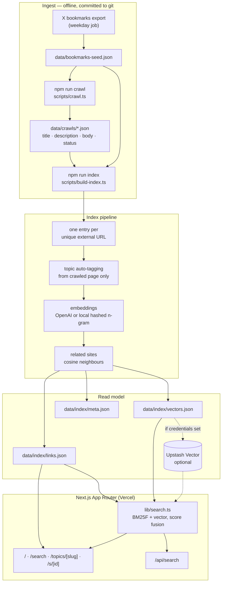

# Bookmarks

Searchable library of the **external sites** Sean Geng saves from X — crawled, topic-grouped,
vector-indexed. Live at **[bookmarks.seangeng.com](https://bookmarks.seangeng.com)**.

The bookmark is not the artifact; the page it points at is. So X bookmarks are treated purely as
a source of URLs, and the library is the set of unique external sites behind them: each page's own
title, meta description, and crawled body text, auto-tagged into a small topic taxonomy, embedded,
and searchable.

**No X content appears anywhere in the product** — no post text, no author handles, no post URLs,
no `t.co` or `x.com` links. A bookmark with no external link produces no entry; a bookmark with
three links produces three, deduplicated by canonical URL across the whole export.

```bash
npm install
npm run sync    # crawl external links, then build the search index
npm run dev     # http://localhost:3000
```

No credentials are required. With an empty environment the pipeline uses local hashed
embeddings and a committed vector file, so search works end to end out of the box; adding
`OPENAI_API_KEY` upgrades it to real semantic embeddings and LLM topic classification, and
adding Upstash credentials moves the vectors off-box.

---

## Architecture



Everything left of the app is offline and committed to git, so a page render needs no
database, no network, and no cold-start warmup. The only runtime dependency is the embedding
call for the search query itself — and with the local provider even that is in-process.

### Two data models

`data/bookmarks-seed.json` is the **source**: the raw X export, kept intact for provenance and
re-processing. `data/index/links.json` is the **product**: one entry per unique external URL,
built only from what the crawler found at that URL. The pipeline is the boundary between them,
and nothing from the post survives it.

---

## Data model

The seed is [`data/bookmarks-seed.json`](data/bookmarks-seed.json) — the real X export of
[@seangeng](https://x.com/seangeng), kept as source data.
[`data/prune-stats.json`](data/prune-stats.json) is the upstream link-prune report that produced
it: which outbound links were probed, which were kept, and which were already dead.

A source bookmark ([`src/lib/types.ts`](src/lib/types.ts)) carries `id`, `text`, `author`, `url`,
`created_at`, `external_urls`, and `short_urls`. Only the last two are used downstream — the rest
exists so the export stays faithful and re-processable.

The seed loader ([`src/lib/normalize.ts`](src/lib/normalize.ts)) is deliberately forgiving: it
accepts a bare array, `{ bookmarks: [...] }`, or `{ data: [...] }`, in snake_case or the shapes
the X API v2 returns (`legacy.full_text`, `entities.urls[].expanded_url`, `author_username`,
`core.screen_name`, Twitter's `"Wed Oct 10 20:19:24 +0000 2018"` dates, …). Anything it cannot
parse is counted and reported rather than silently dropped.

### The library entry

`npm run index` turns those URLs into the rendered library. One entry per unique external URL:

| Field | Source |
| --- | --- |
| `id` | hash of the canonical URL |
| `url`, `domain` | the URL itself, canonicalized (tracking params stripped) |
| `title` | crawled `<title>`/`og:title`, else a readable fallback derived from the URL |
| `description` | the page's own meta description |
| `excerpt`, `word_count` | crawled body text |
| `site_name`, `published_at` | page metadata |
| `status`, `http_status`, `error` | crawl outcome, so unreachable pages stay visible |
| `saved_at`, `saves` | earliest date bookmarked, and how many bookmarks pointed here |
| `topics`, `topic_scores` | classified from the crawled page and its domain |
| `search_text` | title + description + domain + crawled body + topics |
| `related` | nearest neighbours by embedding distance |

There is no author, no post text, and no post URL, by construction.

### Which URLs qualify

A URL enters the library only if it is `http(s)`, is not a link shortener, and is not an X
surface (`x.com`, `twitter.com`, `*.twimg.com`). That filter runs on the export's own
`external_urls` **and** on every destination resolved from a shortener, which matters more than it
sounds: of 247 `t.co` links in this export, 177 unwrap to x.com rather than to a site.

## Scripts

| Command | What it does |
| --- | --- |
| `npm run dev` | Next dev server |
| `npm run build` | Production build (`prebuild` regenerates the index if artifacts are missing) |
| `npm run start` | Serve the production build |
| `npm run crawl` | Fetch every unique external URL, write artifacts to `data/crawls/` |
| `npm run index` | Enrich + auto-tag + embed, write `data/index/`, optionally upsert to Upstash |
| `npm run sync` | `crawl` then `index` |
| `npm run seed:assemble` | Build the seed from the chunked export in `data/seed-parts/` |
| `npm run check:seed` | Validate the seed parses and looks sane, without running the pipeline |
| `npm test` | Pipeline tests (`node:test` via tsx) |
| `npm run lint` / `npm run typecheck` | ESLint / `tsc --noEmit` |

Useful flags:

```bash
npm run crawl -- --force              # re-crawl everything
npm run crawl -- --max-age=7          # re-crawl artifacts older than 7 days
npm run crawl -- --retry-failed       # retry timeouts / 5xx / empty extractions
npm run crawl -- --limit=20 --concurrency=3 --timeout=15000
npm run crawl -- --expand-short-links # resolve t.co/bit.ly links (see below)
npm run crawl -- --ignore-robots      # local debugging only

npm run index -- --provider=local     # force local embeddings even with a key set
npm run index -- --store=local        # skip the Upstash upsert
npm run index -- --no-llm             # force the keyword topic classifier
npm run index -- --dry-run            # print the index summary, write nothing
```

### Tests

`npm test` covers the parts most likely to break on a real export rather than the UI: the X
export adapter (bare arrays vs `{bookmarks}` vs API v2 `legacy`/`entities` shapes, `t.co`
unwrapping, de-duplication, Twitter's legacy date format), URL canonicalization, the
tokenizer and stemmer, topic classification, `robots.txt` pattern precedence, HTML extraction,
and the local embedding provider. [`.github/workflows/ci.yml`](.github/workflows/ci.yml) runs
lint, typecheck, tests, and a build on every pull request.

Three real bugs came out of writing them, all of which silently degraded search: `utm_*` params
were never actually stripped (so one page could produce two crawl keys), the stemmer was not
idempotent (`embeddings` folded to `embedding` while `embedding` folded to `embedd`, so a search
for the plural could not match the singular), and `mailto:` links were being rewritten into
`https://mailto:…` instead of rejected.

### Crawling

`scripts/crawl.ts` is intentionally polite:

- concurrency capped at **5** (`CRAWL_CONCURRENCY`), hard-capped in code
- **10s** timeout per request (`CRAWL_TIMEOUT_MS`), response body capped at 2.5 MB
- `robots.txt` is fetched once per origin, parsed with wildcard/`$` pattern support and
  longest-match precedence, and `Crawl-delay` is honoured (capped at 5s)
- a 750 ms minimum gap between requests to the same host
- a descriptive User-Agent that points back at the site
- results are cached, so re-runs only fetch links that are new or stale

Every attempt is recorded with a status — `ok`, `empty`, `unsupported_type`, `http_error`,
`network_error`, `timeout`, `blocked_by_robots` — so dead links stay visible in the UI instead
of disappearing. Text extraction strips page chrome, picks the densest plausible content
container, and keeps up to 5k characters of block-level text.

The committed crawl covers the library's 69 outbound links: 63 archived, 2 GitHub `/tree/` paths
disallowed by `robots.txt`, 2 JavaScript-only pages with no extractable text, 1 dead domain, and
1 returning 404. The last two are the dead URLs [`data/prune-stats.json`](data/prune-stats.json)
already flagged, and they stay in the index with their status rather than disappearing.

### t.co and why unwrapping is on by default

Whether a bookmark contributes anything depends on the export including a real URL. Many X posts
are a sentence plus a link, and when the export leaves that link as a bare `t.co` shortener there
is no destination to crawl. In this export that is the common case: **123 of 196 bookmarks carry
only a shortener**, and 8 carry no link at all.

Since the library *is* the set of destinations, `npm run crawl` unwraps shorteners by default. It
requests only the redirect — never the shortener's body — follows up to four hops, caches every
outcome in `data/crawls/short-links.json`, and then crawls each destination through the normal
path with its own `robots.txt` check. Resolved destinations go through the same qualification
filter as any other URL, which is how the 177 `t.co` links that unwrap to x.com get dropped.

Two caveats worth stating plainly:

- `t.co/robots.txt` disallows every agent except Twitterbot. Only the redirect is requested, and
  the product depends on it, but it is a deliberate exception to the "everything respects
  robots.txt" rule that holds everywhere else here. `--no-expand-short-links` turns it off.
- **The clean fix is upstream.** If the export includes `entities.urls[].expanded_url` — which the
  X API already returns — no shortener is ever touched and this section stops mattering.

## Search

[`src/lib/search.ts`](src/lib/search.ts) runs two legs and fuses them. Both rank on the page, never
on anything said about it on X.

**Keyword leg** — BM25 with BM25F-style field weights: page title ×3.4, meta description ×2.4,
domain ×2.2, topics ×2, crawled body ×1. Exact phrases get a bonus, larger when the phrase appears
in the title or description. The tokenizer keeps compounds whole *and* split (`zero-knowledge` →
`zero-knowledge`, `zero`, `knowledge`), and every long token is additionally indexed under a
truncated prefix at reduced weight, so `accessibility` finds `accessible`.

**Vector leg** — the query is embedded with the same provider that built the index (recorded in
`data/index/meta.json`; a mismatch is detected and reported rather than silently returning
garbage), then compared against the vector store.

**Fusion** — normalized score fusion, not reciprocal rank fusion. RRF is deliberately insensitive
to score magnitude, which is the wrong default here: a query like `dithering` has one or two right
answers and a long tail of pages that merely mention a related word. Instead, keyword scores are
normalized against the best hit for that query, and cosine similarity is mapped through a
provider-calibrated confidence window. That window is what keeps the local provider honest — its
hashed n-gram vectors are lexical, not semantic, so a 0.06 cosine contributes a nudge; real
embeddings clear the window and become a first-class ranking signal. Vector-only hits must clear a
confidence floor to appear at all.

If the embedding provider is unavailable at request time, the vector leg is skipped, the mode badge
switches to "keyword only", and the UI says so.

`/api/search?q=…&topic=…&limit=…` returns the same results as JSON — `id`, `title`, `url`,
`domain`, `topics`, `snippet`, plus `keyword_rank` and `vector_rank` so ranking stays debuggable.

### Topics

Seven fixed buckets: **AI/ML, UI/Design, DevTools, Infra, Crypto, Reading, Misc**
([`src/lib/topics.ts`](src/lib/topics.ts)). A site can hold up to three.

Classification uses the crawled page only — its title, description, body text, and domain. Post
text is never consulted, which turns out to be an improvement rather than a sacrifice: pages carry
far more signal than a one-line comment about them. Classifying from page content puts just 5 of
71 entries in `Misc`; the earlier post-text version left 50 of 196 bookmarks there.

Assignment is by LLM (`OPENAI_CHAT_MODEL`, default `gpt-4o-mini`) when `OPENAI_API_KEY` is set,
otherwise by a weighted keyword + domain scorer with diminishing returns per repeated term. The
classifier actually used is recorded in `data/index/meta.json` and shown in the site footer.
Failures in the LLM path fall back to the scorer rather than aborting the run.

## Vector backend

The store is chosen from the environment, and the app degrades rather than breaks.

| Backend | When it is used | Notes |
| --- | --- | --- |
| **Local JSON** (default) | no Upstash credentials | `data/index/vectors.json`, exact cosine in-process. Single-digit ms for thousands of bookmarks — a legitimate default, not a stub. |
| **Upstash Vector** | `UPSTASH_VECTOR_REST_URL` + `UPSTASH_VECTOR_REST_TOKEN` | Serverless, free tier, no ops. `npm run index` resets and upserts the index with `topics` metadata; topic-filtered search pushes the filter down to Upstash. |

Force either with `VECTOR_STORE=local|upstash`.

To move to Upstash: create an index at [console.upstash.com](https://console.upstash.com/vector)
with the dimension of your embedding model (**1536** for `text-embedding-3-small`, **512** for
the local provider) and cosine distance, put the REST URL and token in the environment, and
re-run `npm run index`. The vectors file stays in git as a fallback.

Two alternatives were considered and skipped: **Neon + pgvector** needs a connection pooler and
migrations for a dataset that fits in a JSON file, and **Turso/libSQL** would add a second
storage system without removing the embedding call. `VectorStore` in
[`src/lib/vector-store.ts`](src/lib/vector-store.ts) is a two-method interface, so adding either
later is a self-contained change.

---

## Environment variables

Everything is optional. Copy [`.env.example`](.env.example) to `.env.local` and fill in what you
have.

| Variable | Default | Purpose |
| --- | --- | --- |
| `NEXT_PUBLIC_SITE_URL` | `https://bookmarks.seangeng.com` | Canonical origin for metadata, `sitemap.xml`, `robots.txt` |
| `OPENAI_API_KEY` | — | Enables semantic embeddings and LLM topic classification |
| `OPENAI_EMBEDDING_MODEL` | `text-embedding-3-small` | |
| `OPENAI_CHAT_MODEL` | `gpt-4o-mini` | Topic classification |
| `OPENAI_BASE_URL` | `https://api.openai.com/v1` | Any OpenAI-compatible endpoint works |
| `EMBEDDING_PROVIDER` | auto | `openai` \| `local` |
| `UPSTASH_VECTOR_REST_URL` | — | Upstash Vector REST endpoint |
| `UPSTASH_VECTOR_REST_TOKEN` | — | Upstash Vector token |
| `UPSTASH_VECTOR_NAMESPACE` | — | Optional namespace |
| `VECTOR_STORE` | auto | `upstash` \| `local` |
| `CRAWL_CONCURRENCY` | `5` | Hard-capped at 5 |
| `CRAWL_TIMEOUT_MS` | `10000` | Per-request timeout |

Secrets are never committed: `.env*` is git-ignored and the index/crawl artifacts contain only
public page content.

---

## Sync: replacing the seed with a fresh export

The weekday export job produces a JSON file of bookmarks. To refresh the library:

```bash
cp ~/exports/x-bookmarks-2026-09-08.json data/bookmarks-seed.json
npm run sync          # crawls only new/stale links, then rebuilds the index
git add data && git commit -m "chore: refresh bookmarks" && git push
```

That is the whole loop. Details worth knowing:

- **Any reasonable export shape works.** A bare array, `{ bookmarks: [...] }`, or
  `{ data: [...] }`; see [Data model](#data-model). No transform step is needed.
- **Crawling is incremental.** Already-archived links are skipped, so a sync after adding ten
  bookmarks costs ten fetches, not four hundred. Artifacts for links that left the seed are
  deleted, keeping `data/crawls/` in sync with reality.
- **Re-crawl on a cadence** with `npm run crawl -- --max-age=30 --retry-failed` to refresh stale
  archives and retry links that were down.
- **Indexing is a full rebuild** and cheap: local embeddings are in-process, and OpenAI
  embeddings for a few thousand bookmarks are a handful of batched requests.
- **CI can do it for you.** [`.github/workflows/sync.yml`](.github/workflows/sync.yml) triggers on
  any push that touches `data/bookmarks-seed.json`, runs crawl + index with whatever secrets are
  configured, and commits the artifacts — so pushing a new export is enough to ship an updated
  site. It can also be run manually with a `force_recrawl` option.

### Chunked exports

The export can also arrive split across `data/seed-parts/`, alongside a `manifest.json` that
records the expected total and, for each part, its record count, byte size, and line count:

```json
{
  "count": 196,
  "last_id": "2044341633119084609",
  "parts": [{ "file": "part-00.json", "n": 12, "bytes": 7292, "lines": 156 }]
}
```

`npm run seed:assemble` verifies every part against all three numbers before writing anything,
then concatenates them into `data/bookmarks-seed.json`, de-duplicating by id and checking the
total against `count` and that `last_id` is present. A part that is short by even a few bytes is
reported with the exact shortfall and nothing is written. `--if-complete` makes it a no-op while
parts are still arriving — that is the form the sync workflow uses, so pushing the final part is
what triggers assembly, crawl, and indexing.

### When the export upload goes wrong

The seed is written by an external job, so "the file is there but the contents are wrong" is a
real failure mode — an upload step has committed the literal string `<file>` in place of the
export. The pipeline treats a broken seed and an absent seed as different problems, because they
deserve opposite responses:

| Situation | Behaviour |
| --- | --- |
| Artifacts committed, seed fine | Build uses the committed index |
| Artifacts missing, seed fine | `prebuild` rebuilds the index from the seed with local embeddings |
| Artifacts missing, no seed at all | `prebuild` writes empty stubs; the site renders its empty state |
| Seed present but unusable | `npm run check:seed` fails, and `prebuild` **fails the build** rather than deploying an empty library |
| Artifacts committed, seed unusable | Build proceeds on the last known-good index, with a loud warning that it no longer matches the seed |

A truncated export is the nastiest version of this, because the file is perfectly valid JSON and
passes every structural check — it is just missing most of its records. The export declares its
own size, so that is what gets verified: a seed saying `"count": 196` while holding one bookmark
is rejected as truncated. This matters because the pipeline is faithful by design — the crawler
prunes artifacts for links that left the seed — so syncing a truncated seed deletes the archive
for every link it dropped.

`npm run check:seed` reports the count of bookmarks, links, domains, and authors, and warns when
a suspicious share of records have no resolvable author, no date, or empty text — the usual sign
that a new export uses field names the adapter does not read yet. It runs first in CI and again
in the sync workflow before anything is crawled, so a bad upload fails fast instead of quietly
rebuilding the committed artifacts from garbage.

---

## Deploying to Vercel + `bookmarks.seangeng.com`

1. **Import the repo.** [vercel.com/new](https://vercel.com/new) → import `seangeng/bookmarks`.
   The framework preset is detected from [`vercel.json`](vercel.json); build command
   `npm run build`, output handled by the Next.js adapter. No other build settings needed.
2. **Set environment variables** (Project → Settings → Environment Variables) for Production and
   Preview. At minimum `NEXT_PUBLIC_SITE_URL=https://bookmarks.seangeng.com`. Add
   `OPENAI_API_KEY` and the Upstash pair if you want semantic search and a remote store.
3. **Add the domain.** Project → Settings → Domains → add `bookmarks.seangeng.com`. Vercel will
   show the DNS record it wants.
4. **Point DNS at Vercel.** In whatever DNS provider hosts `seangeng.com`, add:

   | Type | Name | Value | TTL |
   | --- | --- | --- | --- |
   | `CNAME` | `bookmarks` | `cname.vercel-dns.com` | 60 (or provider default) |

   Notes: use the exact target Vercel displays for the project — it is normally
   `cname.vercel-dns.com`, but Vercel occasionally issues a project-specific hostname. If DNS is
   on Cloudflare, set the record to **DNS only** (grey cloud); proxying breaks Vercel's domain
   verification and certificate issuance. Do not add an `A` record for a subdomain.
5. **Wait for verification.** Vercel verifies the CNAME and issues a Let's Encrypt certificate
   automatically, usually within a minute or two of propagation. Until then the domain shows as
   "Invalid Configuration" — that is expected, not an error to chase.
6. **Redeploy** once `NEXT_PUBLIC_SITE_URL` is set, so metadata, `sitemap.xml`, and `robots.txt`
   use the custom domain.

This repo does not touch DNS and contains no DNS credentials; step 4 has to be done by whoever
controls the `seangeng.com` zone.

---

## Repo layout

```
data/
  bookmarks-seed.json     source of truth — replace with a fresh X export
  seed-parts/             chunked export + manifest, assembled into the seed
  prune-stats.json        upstream link-prune report for the current seed
  crawls/                 one JSON artifact per unique URL + index.json rollup
  index/                  generated read model: links.json, vectors.json, meta.json
scripts/
  crawl.ts                polite crawler CLI (unwraps shorteners)
  build-index.ts          dedupe URLs + tag + embed + persist
  ensure-index.ts         prebuild guard so a fresh clone always builds
  lib/                    crawler, HTML extraction, LLM classification, fs helpers
tests/
  pipeline.test.ts        export adapter, tokenizer, robots, extraction, embeddings
src/
  app/                    routes: /, /search, /topics, /topics/[slug], /s/[id], /api/search
  components/             cards, search box, topic chips, theme toggle, X embed
  lib/
    types.ts              source Bookmark + LibraryLink models (zod)
    normalize.ts          X export → Bookmark adapter (URL extraction)
    topics.ts             taxonomy + keyword classifier
    embeddings.ts         OpenAI + local hashed n-gram providers
    vector-store.ts       Upstash + local JSON stores
    search.ts             BM25F over page fields + vector, score fusion
    library.ts            read model access
    text.ts               tokenizer, snippets, highlighting
```

Generated data is committed on purpose: it makes the deploy hermetic, keeps the site working
without any backing service, and makes every pipeline change reviewable as a diff.

### Where this design stops working

Worth stating plainly, since the shortcuts are deliberate rather than accidental. The read model
is imported as a module, so it is loaded whole into each server bundle: fine for the hundreds-to
low-thousands of pages a person actually saves, uncomfortable somewhere past ~10k. The exit ramps,
in the order they would be needed: move vectors to Upstash
(already supported by a config change), then switch the read model from a static import to a
traced `fs` read plus pagination, then move the enriched records into Postgres or SQLite and keep
the JSON only as a build cache. Exact in-process cosine search is likewise linear in the corpus;
it is imperceptible here and the `VectorStore` interface is where an ANN index would slot in.

## Stack

Next.js 16 (App Router) · TypeScript · Tailwind CSS 4 · shadcn/ui · zod · cheerio · tsx ·
Upstash Vector (optional) · deployed on Vercel.
